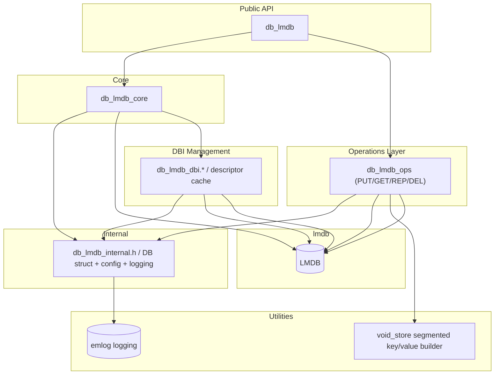
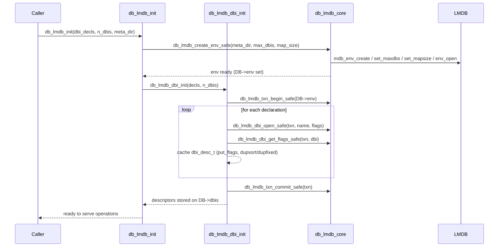

# LMDB Wrapper Architecture

This document summarizes the LMDB wrapper around `db_lmdb_*` in terms of components (static view) and typical control flows (dynamic view). Diagrams use Mermaid for quick inspection.

## Static Architecture

- **Public API (`app/include/db_lmdb/db_lmdb.h`, `app/src/db_lmdb/db_lmdb.c`)**: Low-ceremony entry points to initialize/close the LMDB environment and fetch metrics. Exposes the `dbi_decl_t` declaration type; hides LMDB internals.
- **Core safety & environment (`app/include/db_lmdb/db_lmdb_core.h`, `app/src/core/db_lmdb_core.c`)**: Centralizes LMDB retry/resize policy for env create/open, txn begin/commit, DBI open/flag fetch, and CRUD calls. Maps LMDB return codes to errno-style outcomes.
- **DBI management (`app/include/db_lmdb/db_lmdb_dbi.h`, `app/src/core/db_lmdb_dbi.c`)**: Opens declared named databases inside a bootstrap transaction, caches descriptors (`dbi_desc_t`) with handles/flags/default put flags, and stores them on the global `DB`.
- **Shared state (`app/include/db_lmdb/db_lmdb_internal.h`)**: Defines `struct DB` (env handle, DBI descriptor array, map size tracking) and exports the `DB` singleton used by internal layers. Also holds logging helpers and config constants.
- **Operations layer (`app/include/db_lmdb/db_lmdb_ops.h`, `app/src/ops/db_lmdb_ops.c`)**: Transaction-friendly operations (`PUT/GET/REP/DEL` plus batching via `ops_exec`). Depends on cached DBI descriptors and uses core safety helpers for retries/map growth. This is the only layer that touches `void_store`.
- **Byte-store utility (`app/include/db_lmdb/void_store.h`, `app/src/ops/void_store.c`)**: Small segmented buffer builder used by operations to assemble keys/values or patches without extra copies.
- **External dependencies**: LMDB (storage engine) and `emlog` (logging).

Guiding rules:

- Public callers only depend on `db_lmdb.h` and optionally `db_lmdb_ops.h`.
- `void_store` stays encapsulated inside the operations layer; other packages should not include it.
- DBI descriptors (`dbi_desc_t`) are the bridge between DBI setup and operations; they are owned by the `DB` singleton.

## Dynamic Architecture

### Environment and DBI setup

Sequence of a typical startup via `db_lmdb_init` using an array of `dbi_decl_t` declarations:

Notes and invariants:

- The `DB` singleton is allocated once during init and carries the live LMDB env plus the DBI descriptor array. `db_lmdb_close` tears it down.
- Retry/resize policy lives in `db_lmdb_core` and is reused across env setup, DBI opening, and data operations.
- Operations (`ops_put_one_desc`, `ops_exec`, etc.) expect initialized descriptors and map/resize budgets; they batch work inside single transactions and are the only consumers of `void_store`.
