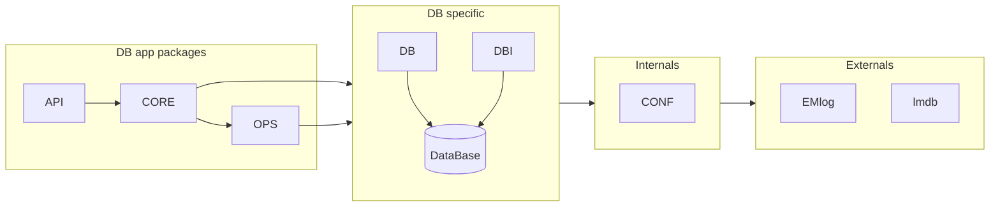
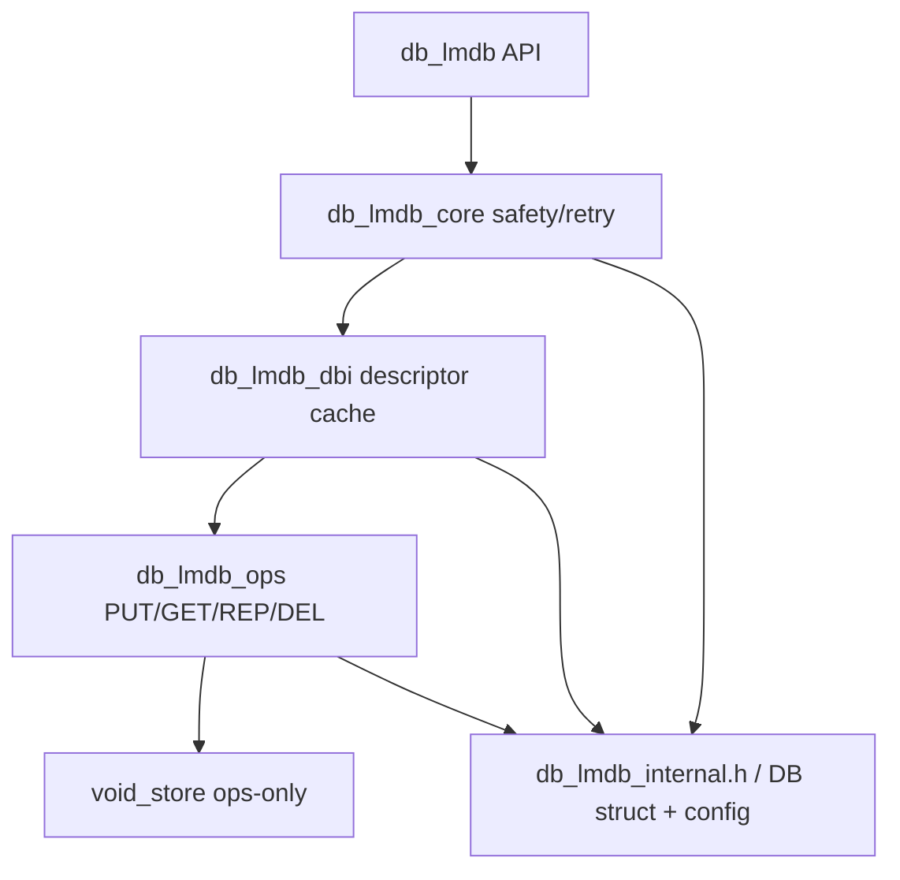
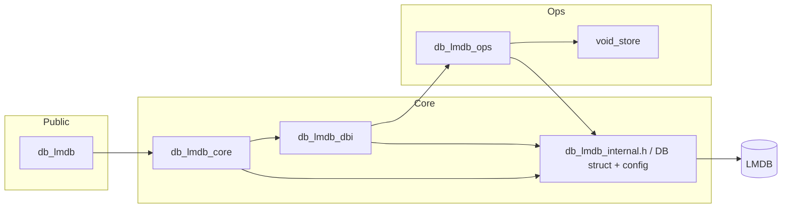
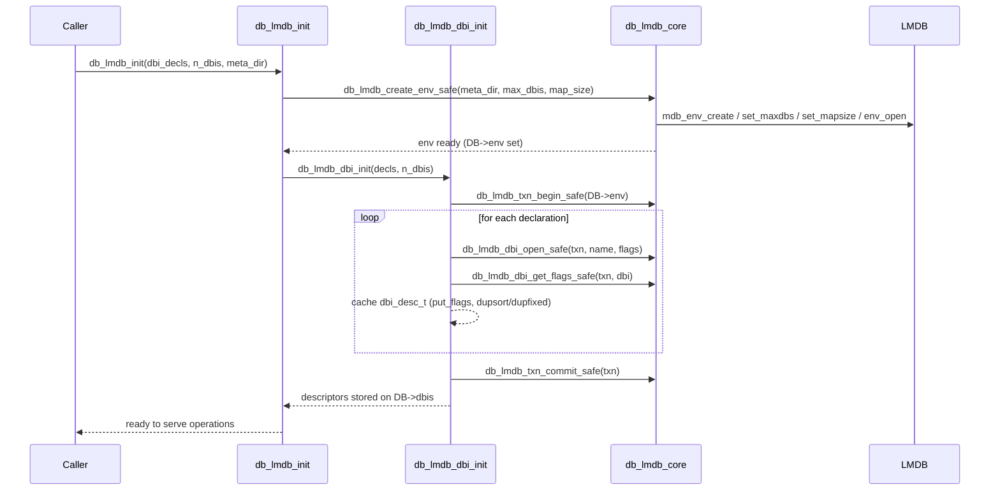

# LMDB Wrapper Architecture

This document summarizes the LMDB wrapper around `db_lmdb_*` in terms of components (static view) and typical control flows (dynamic view). Diagrams use Mermaid for quick inspection.

## Static Architecture

### Packages overview

### DB app packages

Guiding rules (key boundaries):
- `void_store` is an ops-only utility; keep it out of other packages.
- `emlog` is pulled through `db_lmdb_internal.h`, so everything logs via that shim (shown once in the Infra/EMlog columns).
- Public callers only depend on `db_lmdb.h` and optionally `db_lmdb_ops.h`.
- DBI descriptors (`dbi_desc_t`) bridge DBI setup and ops; they live on the `DB` singleton.

## Dynamic Architecture

### Environment and DBI setup

Sequence of a typical startup via `db_lmdb_init` using an array of `dbi_decl_t` declarations:

Notes and invariants:

- The `DB` singleton is allocated once during init and carries the live LMDB env plus the DBI descriptor array. `db_lmdb_close` tears it down.
- Retry/resize policy lives in `db_lmdb_core` and is reused across env setup, DBI opening, and data operations.
- Operations (`ops_put_one_desc`, `ops_exec`, etc.) expect initialized descriptors and map/resize budgets; they batch work inside single transactions and are the only consumers of `void_store`.
