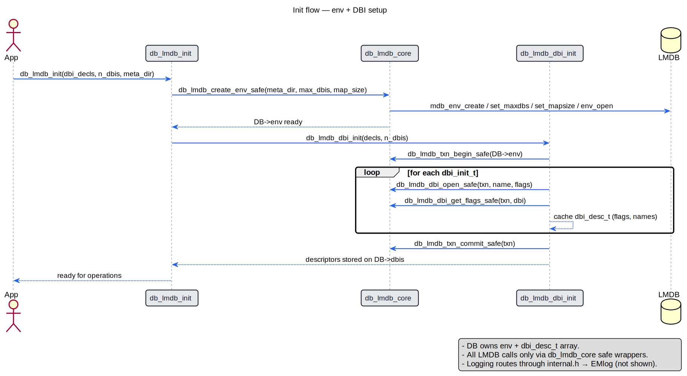
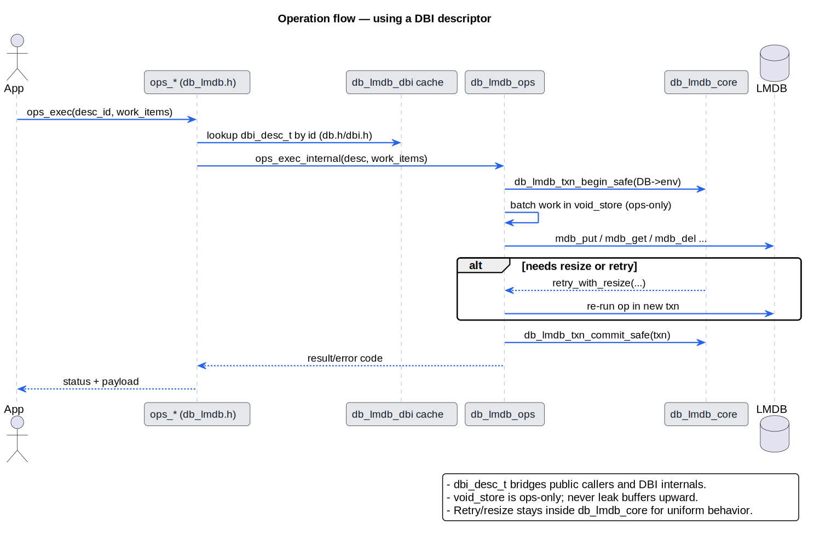

# Dynamic Architecture: LMDB Wrapper

This document explains typical control flows through the LMDB wrapper. Diagrams use PlantUML rendered by CI into SVGs (no Mermaid). Pair this with `STATIC.md` for the structural view.

## Scope
- Environment and DBI initialization, showing how `db.h` exposes `dbi` descriptors.
- Common operation flow (put/get/etc.) and where retries/resize policies live.
- Tear-down and invariants worth keeping in mind while changing code.

## Startup: env and DBI wiring

Key notes:
- `DB` is allocated once during init; it carries the env handle and the array of `dbi_desc_t` that `db.h` exposes.
- All LMDB interactions go through the `db_lmdb_core` safe wrappers to reuse retry/resize logic.
- Logging is centralized via `internal.h` → EMlog; keep it that way to avoid divergent log formats.

## Operations: using a DBI descriptor

Key notes:
- `dbi_desc_t` is the bridge between public callers and DBI internals; keep it lean (names, flags, handles) to avoid leaking internal concerns.
- `void_store` is the only shared scratch buffer in ops. Do not pass it upward; copy data into caller-owned buffers before returning.
- Retry/resize policy must stay within `db_lmdb_core` to keep behavior uniform across env, DBI, and ops calls.

## Tear-down
- `db_lmdb_close` tears down in reverse: stop ops, close DBIs, close env, free `DB`.
- Free any `void_store` allocations and descriptor arrays inside their owning layer; callers should only need to call the single close entrypoint.
- Keep shutdown idempotent: closing twice should be safe and must not reach LMDB with invalid handles.
