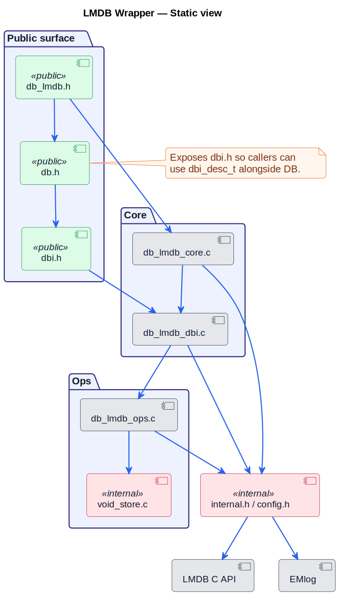
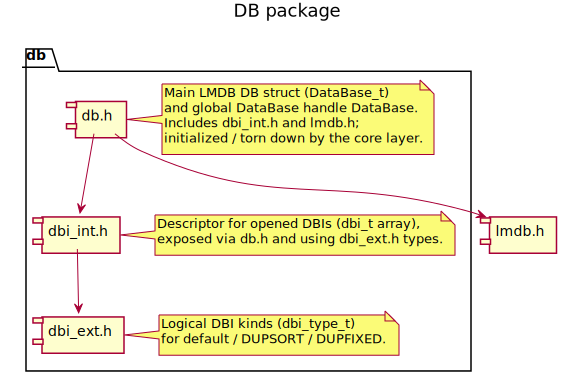
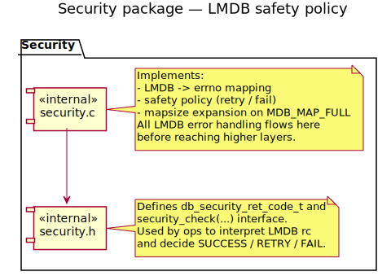
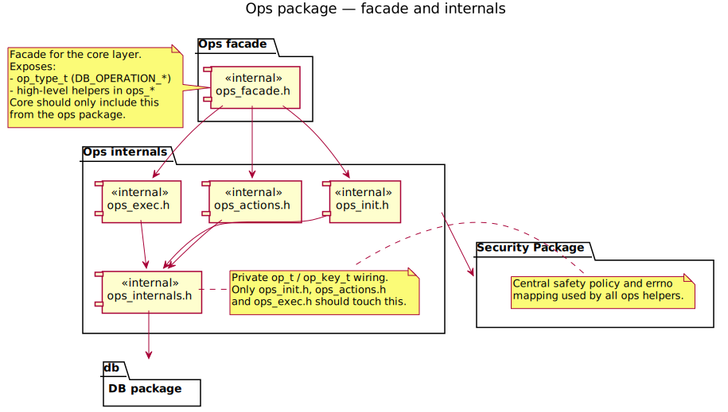

# Static Architecture: LMDB Wrapper

This document captures the structural view of the LMDB wrapper around `db_lmdb_*`. Diagrams use PlantUML and are rendered locally into SVGs (no Mermaid).

## Scope

- Public surface: what headers a consumer includes (`db_lmdb.h`, `db.h`, `dbi.h`) and how `db.h` re-exports DBI structures.
- Internal layering: API → core → DB/DBI management → ops/void store.
- External services: LMDB C API and EMlog reached only through the internal shim (`internal.h`/`config.h`).

## Packages and boundaries (PlantUML-rendered)

### DB package (core/operations/db)

Dedicated view of the `db` package and its internal DBI types:

### Security package (core/operations/security)

Centralized LMDB safety policy and errno mapping used by all operations:

### Ops package (core/operations)

Facade plus internal helpers for environment setup, transactions and batched operations:

### Reading the arrows

- Direction means "depends on" (e.g., `db_lmdb.h` depends on `db_lmdb_core.c`).
- Public callers only see `db_lmdb.h` and `db.h`; `db.h` pulls in `dbi.h` so DBI structs are part of the public contract without leaking C-file internals.
- `void_store` is deliberately only reachable from the ops layer.
- LMDB/EMlog remain hidden behind `internal.h`/`config.h`, keeping externals from bleeding into public headers.

## Responsibility map

- `api/db_lmdb.c` — entrypoints, parameter validation, and high-level lifecycles.
- `core/db_lmdb_core.c` — LMDB env/txn helpers, retries, resize policy.
- `db/db_lmdb_dbi.c` — DBI opening, flag caching, descriptor exposure through `DB`.
- `ops/db_lmdb_ops.c` — operational functions that consume DBI descriptors; batches work in transactions.
- `ops/void_store.c` — scratch space for ops only; keep this out of API/core/db layers.
- `include/db/db.h` — defines `DB` facade and intentionally includes `dbi.h` so DBI descriptors are officially part of the surface.
- `include/db/dbi.h` — public DBI declarations (types/flags); owned by DB package but reusable by callers.
- `include/internal/internal.h` + `include/core/config.h` — common structs/configuration; the only path to LMDB and EMlog.

## Dependency rules (keep the separation of concerns)

- Public headers must not include LMDB or EMlog headers directly; use `internal.h` as the shim.
- `dbi.h` may be included by callers only through `db.h` (exported) or directly (advanced users); do not add C file dependencies there.
- `void_store` stays private to ops; if another layer needs buffers, create a new helper within that layer instead of linking to `void_store`.
- Cross-layer calls flow downward (API → core → dbi → ops). Avoid lateral dependencies to keep the diagram stable.
